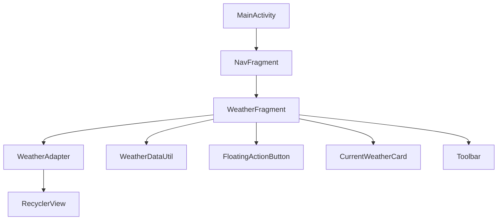
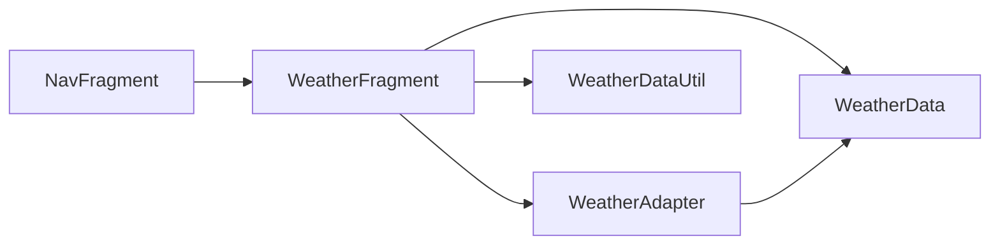
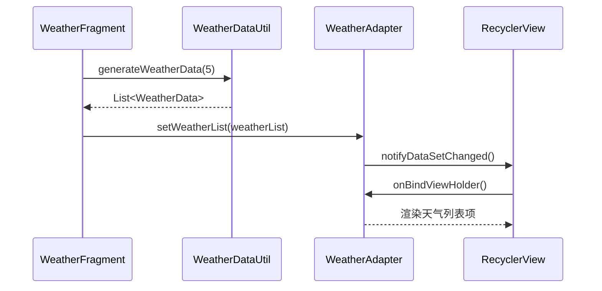
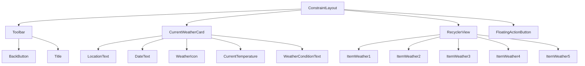
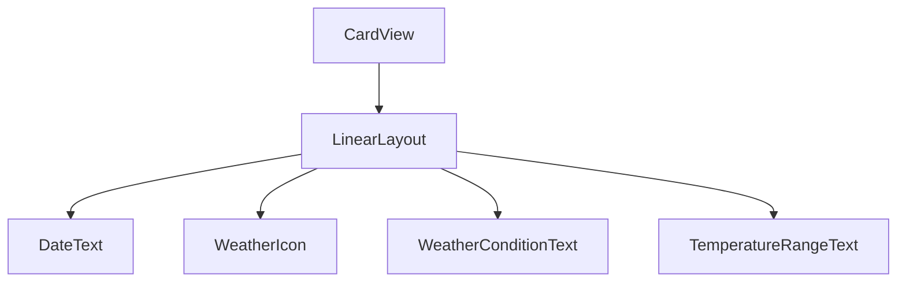

# 天气预报功能 - 架构设计文档

## 1. 整体架构图



## 2. 分层设计和核心组件

### 2.1 表现层 (Presentation Layer)

| 组件 | 职责 | 文件位置 |
|------|------|----------|
| WeatherFragment | 天气预报页面的主要控制器，处理用户交互和UI更新 | ui/weather/WeatherFragment.java |
| WeatherAdapter | RecyclerView的适配器，负责将天气数据绑定到UI组件 | ui/weather/WeatherAdapter.java |
| FragmentWeatherBinding | 视图绑定类，用于安全地访问布局组件 | 自动生成 |
| fragment_weather.xml | 天气预报页面的布局文件 | res/layout/fragment_weather.xml |
| item_weather.xml | 天气预报列表项的布局文件 | res/layout/item_weather.xml |

### 2.2 数据层 (Data Layer)

| 组件 | 职责 | 文件位置 |
|------|------|----------|
| WeatherData | 天气数据模型类，存储单天的天气信息 | ui/weather/WeatherData.java |
| WeatherDataUtil | 模拟天气数据生成工具，提供天气数据的创建和管理 | ui/weather/utils/WeatherDataUtil.java |

## 3. 模块依赖关系图



## 4. 接口契约定义

### 4.1 Fragment间交互接口

| 接口 | 发送者 | 接收者 | 描述 | 参数 | 返回值 |
|------|--------|--------|------|------|--------|
| switchFragment | NavFragment | MainActivity | 切换到WeatherFragment | WeatherFragment | void |

### 4.2 组件间接口

| 接口 | 发送者 | 接收者 | 描述 | 参数 | 返回值 |
|------|--------|--------|------|------|--------|
| setWeatherList | WeatherFragment | WeatherAdapter | 设置天气预报数据列表 | List<WeatherData> | void |
| getWeatherIcon | WeatherAdapter | WeatherData | 获取天气状况对应的图标 | int weatherCondition | int (resourceId) |
| generateWeatherData | WeatherFragment | WeatherDataUtil | 生成模拟天气数据 | int days | List<WeatherData> |

## 5. 数据流向图



## 6. 异常处理策略

| 异常类型 | 处理策略 | 影响范围 |
|----------|----------|----------|
| 数据生成异常 | 使用默认天气数据替代 | 单个页面 |
| UI更新异常 | 捕获异常并记录日志，不影响其他功能 | 单个页面 |
| 内存不足异常 | 及时释放资源，减少列表项数量 | 单个页面 |
| 配置变更异常 | 使用ViewModel保存状态（可选） | 单个页面 |

## 7. 详细设计

### 7.1 WeatherFragment设计

#### 7.1.1 核心功能
- 初始化页面布局和组件
- 生成和加载天气数据
- 处理用户刷新操作
- 更新UI显示

#### 7.1.2 关键方法

```java
// 初始化视图和组件
private void initView()

// 生成和加载天气数据
private void loadWeatherData()

// 处理刷新按钮点击事件
private void handleRefresh()

// 更新当前天气卡片
private void updateCurrentWeatherCard(WeatherData currentWeather)

// 更新天气预报列表
private void updateWeatherList(List<WeatherData> weatherList)
```

### 7.2 WeatherAdapter设计

#### 7.2.1 核心功能
- 将天气数据绑定到RecyclerView的列表项
- 处理列表项的点击事件（如果需要）
- 根据天气状况显示对应的图标

#### 7.2.2 关键方法

```java
// 设置天气数据列表
public void setWeatherList(List<WeatherData> weatherList)

// 绑定数据到列表项
@Override
public void onBindViewHolder(@NonNull WeatherViewHolder holder, int position)

// 获取天气状况对应的图标资源
private int getWeatherIcon(int weatherCondition)
```

### 7.3 WeatherData设计

#### 7.3.1 核心字段

```java
private Date date;                // 日期
private int weatherCondition;     // 天气状况（1:晴, 2:多云, 3:阴, 4:雨, 5:雪）
private String dateText;          // 日期文本（如"周一", "周二"）
private int temperatureMin;       // 最低温度
private int temperatureMax;       // 最高温度
private int currentTemperature;   // 当前实时温度
```

### 7.4 WeatherDataUtil设计

#### 7.4.1 核心功能
- 生成模拟的天气数据
- 提供天气状况的随机生成
- 提供温度范围的随机生成

#### 7.4.2 关键方法

```java
// 生成指定天数的天气数据
public static List<WeatherData> generateWeatherData(int days)

// 生成随机天气状况
private static int generateRandomWeatherCondition()

// 生成随机温度范围
private static int[] generateRandomTemperatureRange()

// 生成随机实时温度
private static int generateCurrentTemperature(int min, int max)
```

## 8. 布局设计

### 8.1 fragment_weather.xml 布局结构



### 8.2 item_weather.xml 布局结构



## 9. 样式和主题设计

### 9.1 颜色方案

| 颜色名称 | 用途 |
|----------|------|
| gradient_start | 页面背景渐变起始色 |
| gradient_mid | 页面背景渐变中间色 |
| gradient_end | 页面背景渐变结束色 |
| neon_cyan | 强调色（温度显示、图标等） |
| neon_purple | 强调色（卡片边框、按钮等） |
| glass_bg | 玻璃态卡片背景色 |
| glass_stroke | 玻璃态卡片边框色 |
| text_primary | 主要文本颜色 |
| text_secondary | 次要文本颜色 |

### 9.2 组件样式

| 组件 | 样式特点 |
|------|----------|
| Toolbar | 玻璃态效果，背景透明度20%，白色边框，霓虹紫色标题 |
| CurrentWeatherCard | 玻璃态效果，背景透明度30%，白色边框，圆角16dp |
| RecyclerView | 深色半透明背景，圆角16dp，阴影效果 |
| ItemWeather | 玻璃态效果，背景透明度20%，白色边框，圆角8dp |
| FloatingActionButton | 霓虹紫色背景，白色图标，阴影效果 |

## 10. 动画和交互设计

### 10.1 页面进入动画
- 页面淡入效果
- 当前天气卡片从顶部滑入
- 天气预报列表从底部滑入

### 10.2 天气图标动画
- 晴天图标：简单的旋转效果
- 多云图标：轻微的上下浮动效果
- 雨天图标：雨滴下落动画（简单实现）

### 10.3 刷新动画
- FloatingActionButton点击时的缩放效果
- 页面刷新时的加载指示器
- 数据更新时的淡入淡出效果

### 10.4 交互反馈
- 列表项点击时的波纹效果
- 按钮点击时的震动反馈
- 加载状态的进度指示器

## 11. 性能优化策略

1. **布局优化**:
   - 使用ConstraintLayout减少布局层级
   - 避免过度使用嵌套布局
   - 使用RecyclerView的视图复用机制

2. **内存优化**:
   - 及时释放不需要的资源
   - 使用弱引用避免内存泄漏
   - 合理使用缓存机制

3. **动画优化**:
   - 使用属性动画替代视图动画
   - 避免在动画中执行复杂计算
   - 使用硬件加速提高动画性能

4. **数据优化**:
   - 使用模拟数据避免网络请求
   - 减少数据对象的创建次数
   - 合理使用线程和异步操作

## 12. 测试策略

### 12.1 单元测试
- WeatherDataUtil的测试：验证模拟数据生成的正确性
- WeatherAdapter的测试：验证数据绑定的正确性
- WeatherData的测试：验证数据模型的正确性

### 12.2 UI测试
- 页面布局测试：验证组件位置和大小的正确性
- 交互测试：验证按钮点击和列表滚动的正确性
- 动画测试：验证动画效果的流畅性

### 12.3 性能测试
- 页面加载时间测试
- 内存使用测试
- 动画性能测试